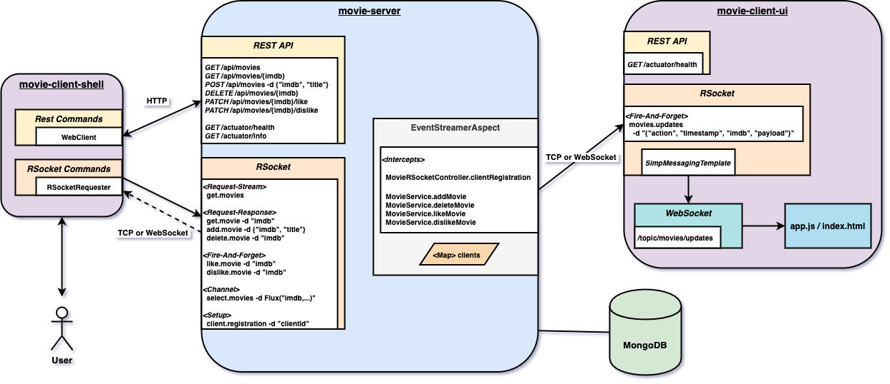

# springboot-rsocket-webflux-aop

The goal of this project is to play with [`RSocket`](https://rsocket.io/) protocol. For it, we will implement three [`Spring Boot`](https://docs.spring.io/spring-boot/docs/current/reference/htmlsingle/) Java applications: `movie-server`, `movie-client-shell` and `movie-client-ui`. As storage, it's used the reactive NoSQL database [`MongoDB`](https://www.mongodb.com/). All the streaming of movie events and the logging are handling by AOP (Aspect Oriented Programming).

## Project Architecture



## Applications

- ### movie-server

  `Spring Boot` Java Web application that exposes REST API endpoints or RSocket routes to manage `movies`. Movies data are stored in reactive `MongoDB`.
  
  `movie-server` has the following profiles:
  
  - `default`
     - start REST API on port `8080` and uses `HTTP`
     
  - `rsocket-tcp`
     - start REST API on port `8080` and uses `HTTP`
     - start RSocket on port `7000` and uses `TCP`
     
  - `rsocket-websocket`
     - start REST API on port `8080` and uses `HTTP`
     - start RSocket with mapping-path `/rsocket` and uses `WebSocket`

- ### movie-client-shell

  `Spring Boot` Shell Java application that has a couple of commands to interact with `movie-server`.
  
  The picture below show those commands
  
  

  It has the following profiles:
  
  - `default`
     - start shell with enabled commands to call `movie-server` REST API endpoints using `HTTP`
     
  - `rsocket-tcp`
     - start shell with enabled commands to call `movie-server` REST API endpoints using `HTTP`
     - start shell with enabled commands to call `movie-server` RSocket routes using `TCP`
     
  - `rsocket-websocket`
     - start shell with enabled commands to call `movie-server` REST API endpoints using `HTTP`
     - start shell with enabled commands to call `movie-server` RSocket routes using `WebSocket`

- ### movie-client-ui

  `Spring Boot` Java Web application that uses [`Thymeleaf`](https://www.thymeleaf.org/) and `Websocket` to show at real-time all the events generated when movies are added, deleted, liked and disliked.

  

  `movie-client-ui` has the following profiles:
  
  - `default`
     - start REST API on port `8081` and uses `HTTP`
     - does not connect to `movie-server` through `RSocket`; does not receive movie events;
     
  - `rsocket-tcp`
     - start REST API on port `8080` and uses `HTTP`
     - connects to `movie-server` through `RSocket`using `TCP`; receives movie events;
     
  - `rsocket-websocket`
     - start REST API on port `8080` and uses `HTTP`
     - connects to `movie-server` through `RSocket`using `WebSocket`; receives movie events;

## Demo

The GIF below shows a user running some commands in `movie-client-shell`, terminal on the right. In the right-top terminal is running `movie-server` and in the right-bottom, `movie-client-ui`. On the background, there's a browser where movie events are displayed. 


## Prerequisites

- [`Java 11+`](https://www.oracle.com/java/technologies/downloads/#java11)
- [`Docker`](https://www.docker.com/)
- [`Docker-Compose`](https://docs.docker.com/compose/install/)

## Start Environment

- Open a terminal and inside `springboot-rsocket-webflux-aop` root folder run
  ```
  docker-compose up -d
  ```

- Wait for `mongodb` Docker container to be up and running. To check it, run
  ```
  docker-compose ps
  ```

## Running applications with Maven

- **movie-server**

  Open a new terminal and, inside `springboot-rsocket-webflux-aop` root folder, run one of the following profile's command
  
  | Profile           | Command                                                                                           |
  | ----------------- | ------------------------------------------------------------------------------------------------- |
  | rsocket-tcp       | ./mvnw clean spring-boot:run --projects movie-server -Dspring-boot.run.profiles=rsocket-tcp       |
  | rsocket-websocket | ./mvnw clean spring-boot:run --projects movie-server -Dspring-boot.run.profiles=rsocket-websocket |
  | default           | ./mvnw clean spring-boot:run --projects movie-server                                              |
  
- **movie-client-shell**

  Open a new terminal and, inside `springboot-rsocket-webflux-aop` root folder, run the following command to build the executable jar file
  ```
  ./mvnw clean package --projects movie-client-shell -DskipTests
  ```

  To start `movie-client-shell`, run the profile's command you picked to run `movie-server`
  
  | Profile           | Commands                                                                                                    |
  | ----------------- | ----------------------------------------------------------------------------------------------------------- |
  | rsocket-tcp       | export SPRING_PROFILES_ACTIVE=rsocket-tcp && ./movie-client-shell/target/movie-client-shell-1.0.0.jar       |
  | rsocket-websocket | export SPRING_PROFILES_ACTIVE=rsocket-websocket && ./movie-client-shell/target/movie-client-shell-1.0.0.jar |
  | default           | export SPRING_PROFILES_ACTIVE=default && ./movie-client-shell/target/movie-client-shell-1.0.0.jar           |

- **movie-client-ui**

  Open a new terminal and, inside `springboot-rsocket-webflux-aop` root folder, run the profile's command you picked to run `movie-server`
  
  | Profile           | Command                                                                                              |
  | ----------------- | ---------------------------------------------------------------------------------------------------- |
  | rsocket-tcp       | ./mvnw clean spring-boot:run --projects movie-client-ui -Dspring-boot.run.profiles=rsocket-tcp       |
  | rsocket-websocket | ./mvnw clean spring-boot:run --projects movie-client-ui -Dspring-boot.run.profiles=rsocket-websocket |
  | default           | ./mvnw clean spring-boot:run --projects movie-client-ui                                              |

## Running applications as Docker containers

- ### Build Docker images

  - In a terminal, make sure you are in `springboot-rsocket-webflux-aop` root folder
  - Run the following script to build the Docker images
    - JVM
      ```
      ./docker-build.sh
      ```
    - Native (it's not implemented yet)
      ```
      ./docker-build.sh native
      ```

- ### Environment variables

  - **movie-server**

    | Environment Variable | Description                                                       |
    | -------------------- | ----------------------------------------------------------------- |
    | `MONGODB_HOST`       | Specify host of the `Mongo` database to use (default `localhost`) |
    | `MONGODB_PORT`       | Specify port of the `Mongo` database to use (default `27017`)     |

  - **movie-client-shell**

    | Environment Variable | Description                                                     |
    | -------------------- | --------------------------------------------------------------- |
    | `MOVIE_SERVER_HOST`  | Specify host of the `movie-server` to use (default `localhost`) |

  - **movie-client-ui**

    | Environment Variable | Description                                                     |
    | -------------------- | --------------------------------------------------------------- |
    | `MOVIE_SERVER_HOST`  | Specify host of the `movie-server` to use (default `localhost`) |

- ### Start Docker containers

  - In a terminal, make sure you are inside `springboot-rsocket-webflux-aop` root folder
  - Run following command
    - rsocket-tcp
      ```
      ./start-server-and-ui.sh rsocket-tcp && ./start-shell.sh rsocket-tcp
      ```
    - rsocket-websocket
      ```
      ./start-server-and-ui.sh rsocket-websocket && ./start-shell.sh rsocket-websocket
      ```
    - default
      ```
      ./start-server-and-ui.sh && ./start-shell.sh
      ```

## Application's URL

| Application     | Type     | Transport | URL                         |
| --------------- | -------- | --------- | --------------------------- |
| movie-server    | RSocket  | TCP       | tcp://localhost:7000        |
| movie-server    | RSocket  | WebSocket | ws://localhost:8080/rsocket |
| movie-server    | REST     | HTTP      | http://localhost:8080       |
| movie-client-ui | Website  | HTTP      | http://localhost:8081       |

> **Note:** you can see the clients connected to `movie-server` by calling the `info` actuator endpoint
> ```
> curl -i localhost:8080/actuator/info
> ```

## Playing Around with movie-client-shell commands

> **Note:** to run the commands below, you must start `movie-server` and `movie-client-shell` with `rsocket-tcp` or `rsocket-websocket` profiles

- Open a browser and access `movie-client-ui` at http://localhost:8081

- Go to `movie-client-shell` terminal

- Add a movie using RSocket (`Request-Response`) 
  ```
  add-movie-rsocket --imdb aaa --title "RSocketland"
  ```
  
  It should return
  ```
  {"imdb":"aaa","title":"RSocketland","lastModifiedDate":"2020-07-20T12:43:39.857248","likes":0,"dislikes":0}
  ```
  
  A `+` action should be displayed in `movie-client-ui`
  
- Add a movie using REST
  ```
  add-movie-rest --imdb bbb --title "I, REST"
  ```
  
  It should return
  ```
  {"imdb":"bbb","title":"I, REST","lastModifiedDate":"2020-07-20T12:44:13.266657","likes":0,"dislikes":0}
  ```
  
  A `+` action should be displayed in `movie-client-ui`
  
- Send a like to `RSocketland` movie using RSocket (`Fire-And-Forget`)
  ```
  like-movie-rsocket --imdb aaa
  ```
  
  It should return
  ```
  Like submitted
  ```
  
  A `thumbs-up` action should be displayed in `movie-client-ui`

- Get all movies using RSocket (`Request-Stream`)
  ```
  get-movies-rsocket
  ```
  
  It should return
  ```
  {"imdb":"aaa","title":"RSocketland","lastModifiedDate":"2020-07-20T12:56:34.565","likes":1,"dislikes":0}
  {"imdb":"bbb","title":"I, REST","lastModifiedDate":"2020-07-20T12:56:26.846","likes":0,"dislikes":0}
  ```
  
- Select movies using RSocket (`Channel`)
  ```
  select-movies-rsocket --imdbs aaa,bbb
  ```
  
  It should return
  ```
  | IMBD: aaa        | TITLE: RSocketland                    | LIKES: 1     | DISLIKES: 0     |
  | IMBD: bbb        | TITLE: I, REST                        | LIKES: 0     | DISLIKES: 0     |
  ```
  
- Delete movie `RSocketland` using RSocket (`Request-Response`) and movie `I, REST` using REST
  ```
  delete-movie-rsocket --imdb aaa
  delete-movie-rest --imdb bbb
  ```
  
  It should return, as response, the IMDB of the movies
  
  A `-` actions should be displayed in `movie-client-ui`
  
- **Simulation**

  There are two scripts that contain some commands to add, retrieve, like, dislikes and delete movies. One uses REST and another RSocket to communicate with `movie-server`. At the end of the script execution, it's shown the `Execution Time` in `milliseconds`.
  
  - If you are running the applications with Maven
    - REST
      ```
      script ../src/main/resources/simulation-rest.txt
      ```
    - RSocket
      ```
      script ../src/main/resources/simulation-rsocket.txt
      ```

  - If you are running the applications as Docker containers
    - REST
      ```
      script /app/resources/simulation-rest.txt
      ```
    - RSocket
      ```
      script /app/resources/simulation-rsocket.txt
      ```

## Useful Commands

- **MongoDB**

  Find all movies
  ```
  docker exec -it mongodb mongo moviedb
  db.movies.find()
  ```
  > Type `exit` to get out of `MongoDB` shell

## Shutdown

- To stop `movie-client-shell`, go to the terminal where it is running and type `exit`
- To stop `movie-server` and `movie-client-ui`
  - If you start them with Maven, go to the terminals where they are running and press `Ctrl+C`
  - If you start them as Docker containers, go to a terminal and run the following command
    ```
    docker stop movie-server movie-client-ui
    ```
- To stop and remove docker-compose `mongodb` container, network and volumes, go to a terminal and, inside `springboot-rsocket-webflux-aop` root folder, run the command below
  ```
  docker-compose down -v
  ```

## Cleanup

To remove the Docker images created by this project, go to a terminal and, inside `springboot-rsocket-webflux-aop` root folder, run the script below
```
./remove-docker-images.sh
```

## References

- https://docs.spring.io/spring/docs/current/spring-framework-reference/web-reactive.html#rsocket
- https://spring.io/blog/2020/05/12/getting-started-with-rsocket-servers-calling-clients
- https://grapeup.com/blog/reactive-service-to-service-communication-with-rsocket-introduction/

## Issues

#### movie-server

After building the Docker native image successfully, an exception is thrown at startup time
```
ERROR 1 --- [           main] o.s.boot.SpringApplication               : Application run failed

org.springframework.context.ApplicationContextException: Unable to start reactive web server; nested exception is org.springframework.beans.factory.BeanCreationException: Error creating bean with name 'nettyReactiveWebServerFactory' defined in class path resource [org/springframework/boot/autoconfigure/web/reactive/ReactiveWebServerFactoryConfiguration$EmbeddedNetty.class]: Initialization of bean failed; nested exception is org.springframework.beans.factory.BeanCreationException: Error creating bean with name 'reactiveWebServerFactoryCustomizer' defined in class path resource [org/springframework/boot/autoconfigure/web/reactive/ReactiveWebServerFactoryAutoConfiguration.class]: Initialization of bean failed; nested exception is com.oracle.svm.core.jdk.UnsupportedFeatureError: Proxy class defined by interfaces [interface org.springframework.boot.web.server.WebServerFactoryCustomizer, interface org.springframework.core.Ordered] not found. Generating proxy classes at runtime is not supported. Proxy classes need to be defined at image build time by specifying the list of interfaces that they implement. To define proxy classes use -H:DynamicProxyConfigurationFiles=<comma-separated-config-files> and -H:DynamicProxyConfigurationResources=<comma-separated-config-resources> options.
	at org.springframework.boot.web.reactive.context.ReactiveWebServerApplicationContext.onRefresh(ReactiveWebServerApplicationContext.java:82) ~[na:na]
	at org.springframework.context.support.AbstractApplicationContext.refresh(AbstractApplicationContext.java:577) ~[na:na]
	at org.springframework.boot.web.reactive.context.ReactiveWebServerApplicationContext.refresh(ReactiveWebServerApplicationContext.java:64) ~[na:na]
	at org.springframework.boot.SpringApplication.refresh(SpringApplication.java:754) ~[com.mycompany.movieserver.MovieServerApplication:2.5.4]
	at org.springframework.boot.SpringApplication.refreshContext(SpringApplication.java:434) ~[com.mycompany.movieserver.MovieServerApplication:2.5.4]
	at org.springframework.boot.SpringApplication.run(SpringApplication.java:338) ~[com.mycompany.movieserver.MovieServerApplication:2.5.4]
	at org.springframework.boot.SpringApplication.run(SpringApplication.java:1343) ~[com.mycompany.movieserver.MovieServerApplication:2.5.4]
	at org.springframework.boot.SpringApplication.run(SpringApplication.java:1332) ~[com.mycompany.movieserver.MovieServerApplication:2.5.4]
	at com.mycompany.movieserver.MovieServerApplication.main(MovieServerApplication.java:18) ~[com.mycompany.movieserver.MovieServerApplication:na]
Caused by: org.springframework.beans.factory.BeanCreationException: Error creating bean with name 'nettyReactiveWebServerFactory' defined in class path resource [org/springframework/boot/autoconfigure/web/reactive/ReactiveWebServerFactoryConfiguration$EmbeddedNetty.class]: Initialization of bean failed; nested exception is org.springframework.beans.factory.BeanCreationException: Error creating bean with name 'reactiveWebServerFactoryCustomizer' defined in class path resource [org/springframework/boot/autoconfigure/web/reactive/ReactiveWebServerFactoryAutoConfiguration.class]: Initialization of bean failed; nested exception is com.oracle.svm.core.jdk.UnsupportedFeatureError: Proxy class defined by interfaces [interface org.springframework.boot.web.server.WebServerFactoryCustomizer, interface org.springframework.core.Ordered] not found. Generating proxy classes at runtime is not supported. Proxy classes need to be defined at image build time by specifying the list of interfaces that they implement. To define proxy classes use -H:DynamicProxyConfigurationFiles=<comma-separated-config-files> and -H:DynamicProxyConfigurationResources=<comma-separated-config-resources> options.
	at org.springframework.beans.factory.support.AbstractAutowireCapableBeanFactory.doCreateBean(AbstractAutowireCapableBeanFactory.java:610) ~[na:na]
	at org.springframework.beans.factory.support.AbstractAutowireCapableBeanFactory.createBean(AbstractAutowireCapableBeanFactory.java:524) ~[na:na]
	at org.springframework.beans.factory.support.AbstractBeanFactory.lambda$doGetBean$0(AbstractBeanFactory.java:335) ~[na:na]
	at org.springframework.beans.factory.support.DefaultSingletonBeanRegistry.getSingleton(DefaultSingletonBeanRegistry.java:234) ~[na:na]
	at org.springframework.beans.factory.support.AbstractBeanFactory.doGetBean(AbstractBeanFactory.java:333) ~[na:na]
	at org.springframework.beans.factory.support.AbstractBeanFactory.getBean(AbstractBeanFactory.java:213) ~[na:na]
	at org.springframework.boot.web.reactive.context.ReactiveWebServerApplicationContext.getWebServerFactory(ReactiveWebServerApplicationContext.java:119) ~[na:na]
	at org.springframework.boot.web.reactive.context.ReactiveWebServerApplicationContext.createWebServer(ReactiveWebServerApplicationContext.java:91) ~[na:na]
	at org.springframework.boot.web.reactive.context.ReactiveWebServerApplicationContext.onRefresh(ReactiveWebServerApplicationContext.java:79) ~[na:na]
	... 8 common frames omitted
Caused by: org.springframework.beans.factory.BeanCreationException: Error creating bean with name 'reactiveWebServerFactoryCustomizer' defined in class path resource [org/springframework/boot/autoconfigure/web/reactive/ReactiveWebServerFactoryAutoConfiguration.class]: Initialization of bean failed; nested exception is com.oracle.svm.core.jdk.UnsupportedFeatureError: Proxy class defined by interfaces [interface org.springframework.boot.web.server.WebServerFactoryCustomizer, interface org.springframework.core.Ordered] not found. Generating proxy classes at runtime is not supported. Proxy classes need to be defined at image build time by specifying the list of interfaces that they implement. To define proxy classes use -H:DynamicProxyConfigurationFiles=<comma-separated-config-files> and -H:DynamicProxyConfigurationResources=<comma-separated-config-resources> options.
	at org.springframework.beans.factory.support.AbstractAutowireCapableBeanFactory.doCreateBean(AbstractAutowireCapableBeanFactory.java:610) ~[na:na]
	at org.springframework.beans.factory.support.AbstractAutowireCapableBeanFactory.createBean(AbstractAutowireCapableBeanFactory.java:524) ~[na:na]
	at org.springframework.beans.factory.support.AbstractBeanFactory.lambda$doGetBean$0(AbstractBeanFactory.java:335) ~[na:na]
	at org.springframework.beans.factory.support.DefaultSingletonBeanRegistry.getSingleton(DefaultSingletonBeanRegistry.java:234) ~[na:na]
	at org.springframework.beans.factory.support.AbstractBeanFactory.doGetBean(AbstractBeanFactory.java:333) ~[na:na]
	at org.springframework.beans.factory.support.AbstractBeanFactory.getBean(AbstractBeanFactory.java:208) ~[na:na]
	at org.springframework.beans.factory.support.DefaultListableBeanFactory.getBeansOfType(DefaultListableBeanFactory.java:671) ~[na:na]
	at org.springframework.boot.web.server.WebServerFactoryCustomizerBeanPostProcessor.getWebServerFactoryCustomizerBeans(WebServerFactoryCustomizerBeanPostProcessor.java:87) ~[com.mycompany.movieserver.MovieServerApplication:2.5.4]
	at org.springframework.boot.web.server.WebServerFactoryCustomizerBeanPostProcessor.getCustomizers(WebServerFactoryCustomizerBeanPostProcessor.java:78) ~[com.mycompany.movieserver.MovieServerApplication:2.5.4]
	at org.springframework.boot.web.server.WebServerFactoryCustomizerBeanPostProcessor.postProcessBeforeInitialization(WebServerFactoryCustomizerBeanPostProcessor.java:70) ~[com.mycompany.movieserver.MovieServerApplication:2.5.4]
	at org.springframework.boot.web.server.WebServerFactoryCustomizerBeanPostProcessor.postProcessBeforeInitialization(WebServerFactoryCustomizerBeanPostProcessor.java:58) ~[com.mycompany.movieserver.MovieServerApplication:2.5.4]
	at org.springframework.beans.factory.support.AbstractAutowireCapableBeanFactory.applyBeanPostProcessorsBeforeInitialization(AbstractAutowireCapableBeanFactory.java:422) ~[na:na]
	at org.springframework.beans.factory.support.AbstractAutowireCapableBeanFactory.initializeBean(AbstractAutowireCapableBeanFactory.java:1778) ~[na:na]
	at org.springframework.beans.factory.support.AbstractAutowireCapableBeanFactory.doCreateBean(AbstractAutowireCapableBeanFactory.java:602) ~[na:na]
	... 16 common frames omitted
Caused by: com.oracle.svm.core.jdk.UnsupportedFeatureError: Proxy class defined by interfaces [interface org.springframework.boot.web.server.WebServerFactoryCustomizer, interface org.springframework.core.Ordered] not found. Generating proxy classes at runtime is not supported. Proxy classes need to be defined at image build time by specifying the list of interfaces that they implement. To define proxy classes use -H:DynamicProxyConfigurationFiles=<comma-separated-config-files> and -H:DynamicProxyConfigurationResources=<comma-separated-config-resources> options.
	at com.oracle.svm.core.util.VMError.unsupportedFeature(VMError.java:88) ~[na:na]
	at com.oracle.svm.reflect.proxy.DynamicProxySupport.getProxyClass(DynamicProxySupport.java:113) ~[na:na]
	at java.lang.reflect.Proxy.getProxyConstructor(Proxy.java:66) ~[com.mycompany.movieserver.MovieServerApplication:na]
	at java.lang.reflect.Proxy.getProxyClass(Proxy.java:384) ~[com.mycompany.movieserver.MovieServerApplication:na]
	at org.springframework.util.ClassUtils.createCompositeInterface(ClassUtils.java:784) ~[na:na]
	at org.springframework.aop.aspectj.AspectJExpressionPointcut.getTargetShadowMatch(AspectJExpressionPointcut.java:437) ~[na:na]
	at org.springframework.aop.aspectj.AspectJExpressionPointcut.matches(AspectJExpressionPointcut.java:295) ~[na:na]
	at org.springframework.aop.support.AopUtils.canApply(AopUtils.java:251) ~[na:na]
	at org.springframework.aop.support.AopUtils.canApply(AopUtils.java:289) ~[na:na]
	at org.springframework.aop.support.AopUtils.findAdvisorsThatCanApply(AopUtils.java:321) ~[na:na]
	at org.springframework.aop.framework.autoproxy.AbstractAdvisorAutoProxyCreator.findAdvisorsThatCanApply(AbstractAdvisorAutoProxyCreator.java:128) ~[com.mycompany.movieserver.MovieServerApplication:5.3.9]
	at org.springframework.aop.framework.autoproxy.AbstractAdvisorAutoProxyCreator.findEligibleAdvisors(AbstractAdvisorAutoProxyCreator.java:97) ~[com.mycompany.movieserver.MovieServerApplication:5.3.9]
	at org.springframework.aop.framework.autoproxy.AbstractAdvisorAutoProxyCreator.getAdvicesAndAdvisorsForBean(AbstractAdvisorAutoProxyCreator.java:78) ~[com.mycompany.movieserver.MovieServerApplication:5.3.9]
	at org.springframework.aop.framework.autoproxy.AbstractAutoProxyCreator.wrapIfNecessary(AbstractAutoProxyCreator.java:339) ~[com.mycompany.movieserver.MovieServerApplication:5.3.9]
	at org.springframework.aop.framework.autoproxy.AbstractAutoProxyCreator.postProcessAfterInitialization(AbstractAutoProxyCreator.java:291) ~[com.mycompany.movieserver.MovieServerApplication:5.3.9]
	at org.springframework.beans.factory.support.AbstractAutowireCapableBeanFactory.applyBeanPostProcessorsAfterInitialization(AbstractAutowireCapableBeanFactory.java:437) ~[na:na]
	at org.springframework.beans.factory.support.AbstractAutowireCapableBeanFactory.initializeBean(AbstractAutowireCapableBeanFactory.java:1790) ~[na:na]
	at org.springframework.beans.factory.support.AbstractAutowireCapableBeanFactory.doCreateBean(AbstractAutowireCapableBeanFactory.java:602) ~[na:na]
	... 29 common frames omitted
```

#### movie-client-shell

An exception is thrown while generating the jar file
```
[INFO] Spring Native operating mode: native
[ERROR] java.lang.IllegalStateException: ERROR: in 'org.springframework.shell.jline.JLineShellAutoConfiguration' these methods are directly invoking methods marked @Bean: [interactiveApplicationRunner, lineReader, lineReader, lineReader] - due to the enforced proxyBeanMethods=false for components in a native-image, please consider refactoring to use instance injection. If you are confident this is not going to affect your application, you may turn this check off using -Dspring.native.verify=false.
[ERROR] [org.springframework.nativex.type.Type.verifyComponent(Type.java:2519),
   org.springframework.nativex.support.ResourcesHandler.processType(ResourcesHandler.java:1340),
   org.springframework.nativex.support.ResourcesHandler.processType(ResourcesHandler.java:1007),
   org.springframework.nativex.support.ResourcesHandler.checkAndRegisterConfigurationType(ResourcesHandler.java:997),
   org.springframework.nativex.support.ResourcesHandler.processFactoriesKey(ResourcesHandler.java:925),
   org.springframework.nativex.support.ResourcesHandler.processSpringFactory(ResourcesHandler.java:874),
   org.springframework.nativex.support.ResourcesHandler.processSpringFactories(ResourcesHandler.java:697),
   org.springframework.nativex.support.ResourcesHandler.register(ResourcesHandler.java:114),
   org.springframework.nativex.support.SpringAnalyzer.analyze(SpringAnalyzer.java:87),
   org.springframework.aot.nativex.ConfigurationContributor.contribute(ConfigurationContributor.java:70),
   org.springframework.aot.BootstrapCodeGenerator.generate(BootstrapCodeGenerator.java:77),
   org.springframework.aot.maven.TestGenerateMojo.execute(TestGenerateMojo.java:65),
   org.apache.maven.plugin.DefaultBuildPluginManager.executeMojo(DefaultBuildPluginManager.java:137),
   org.apache.maven.lifecycle.internal.MojoExecutor.execute(MojoExecutor.java:210),
   org.apache.maven.lifecycle.internal.MojoExecutor.execute(MojoExecutor.java:156),
   org.apache.maven.lifecycle.internal.MojoExecutor.execute(MojoExecutor.java:148),
   org.apache.maven.lifecycle.internal.LifecycleModuleBuilder.buildProject(LifecycleModuleBuilder.java:117),
   org.apache.maven.lifecycle.internal.LifecycleModuleBuilder.buildProject(LifecycleModuleBuilder.java:81),
   org.apache.maven.lifecycle.internal.builder.singlethreaded.SingleThreadedBuilder.build(SingleThreadedBuilder.java:56),
   org.apache.maven.lifecycle.internal.LifecycleStarter.execute(LifecycleStarter.java:128),
   org.apache.maven.DefaultMaven.doExecute(DefaultMaven.java:305),
   org.apache.maven.DefaultMaven.doExecute(DefaultMaven.java:192),
   org.apache.maven.DefaultMaven.execute(DefaultMaven.java:105),
   org.apache.maven.cli.MavenCli.execute(MavenCli.java:972),
   org.apache.maven.cli.MavenCli.doMain(MavenCli.java:293),
   org.apache.maven.cli.MavenCli.main(MavenCli.java:196),
   java.base/jdk.internal.reflect.NativeMethodAccessorImpl.invoke0(Native Method),
   java.base/jdk.internal.reflect.NativeMethodAccessorImpl.invoke(NativeMethodAccessorImpl.java:62),
   java.base/jdk.internal.reflect.DelegatingMethodAccessorImpl.invoke(DelegatingMethodAccessorImpl.java:43),
   java.base/java.lang.reflect.Method.invoke(Method.java:566),
   org.codehaus.plexus.classworlds.launcher.Launcher.launchEnhanced(Launcher.java:282),
   org.codehaus.plexus.classworlds.launcher.Launcher.launch(Launcher.java:225),
   org.codehaus.plexus.classworlds.launcher.Launcher.mainWithExitCode(Launcher.java:406),
   org.codehaus.plexus.classworlds.launcher.Launcher.main(Launcher.java:347),
   java.base/jdk.internal.reflect.NativeMethodAccessorImpl.invoke0(Native Method),
   java.base/jdk.internal.reflect.NativeMethodAccessorImpl.invoke(NativeMethodAccessorImpl.java:62),
   java.base/jdk.internal.reflect.DelegatingMethodAccessorImpl.invoke(DelegatingMethodAccessorImpl.java:43),
   java.base/java.lang.reflect.Method.invoke(Method.java:566),
   org.apache.maven.wrapper.BootstrapMainStarter.start(BootstrapMainStarter.java:39),
   org.apache.maven.wrapper.WrapperExecutor.execute(WrapperExecutor.java:122),
   org.apache.maven.wrapper.MavenWrapperMain.main(MavenWrapperMain.java:61)]
```

#### movie-client-ui

An exception is thrown while building Docker native image 
```
[INFO]     [creator]     Error: com.oracle.graal.pointsto.constraints.UnsupportedFeatureException: Detected an instance of Random/SplittableRandom class in the image heap. Instances created during image generation have cached seed values and don't behave as expected.  To see how this object got instantiated use --trace-object-instantiation=java.util.Random. The object was probably created by a class initializer and is reachable from a static field. You can request class initialization at image runtime by using the option --initialize-at-run-time=<class-name>. Or you can write your own initialization methods and call them explicitly from your main entry point.
[INFO]     [creator]     Detailed message:
[INFO]     [creator]     Trace:
[INFO]     [creator]     	at parsing org.springframework.web.socket.sockjs.support.AbstractSockJsService.access$200(AbstractSockJsService.java:68)
[INFO]     [creator]     Call path from entry point to org.springframework.web.socket.sockjs.support.AbstractSockJsService$InfoHandler.handle(ServerHttpRequest, ServerHttpResponse):
[INFO]     [creator]     	at org.springframework.web.socket.sockjs.support.AbstractSockJsService$InfoHandler.handle(AbstractSockJsService.java:590)
[INFO]     [creator]     	at org.springframework.web.socket.sockjs.support.AbstractSockJsService.handleRequest(AbstractSockJsService.java:413)
[INFO]     [creator]     	at org.springframework.web.socket.sockjs.support.SockJsHttpRequestHandler.handleRequest(SockJsHttpRequestHandler.java:134)
[INFO]     [creator]     	at org.springframework.web.servlet.mvc.HttpRequestHandlerAdapter.handle(HttpRequestHandlerAdapter.java:52)
[INFO]     [creator]     	at org.springframework.web.servlet.DispatcherServlet.doDispatch(DispatcherServlet.java:1064)
[INFO]     [creator]     	at org.springframework.web.servlet.DispatcherServlet.doService(DispatcherServlet.java:963)
[INFO]     [creator]     	at org.springframework.web.servlet.FrameworkServlet.processRequest(FrameworkServlet.java:1006)
[INFO]     [creator]     	at org.springframework.web.servlet.FrameworkServlet.service(FrameworkServlet.java:880)
[INFO]     [creator]     	at javax.servlet.http.HttpServlet.service(HttpServlet.java:764)
[INFO]     [creator]     	at org.apache.catalina.core.ApplicationFilterChain.internalDoFilter(ApplicationFilterChain.java:227)
[INFO]     [creator]     	at org.apache.catalina.core.ApplicationFilterChain.doFilter(ApplicationFilterChain.java:162)
[INFO]     [creator]     	at org.apache.catalina.core.ApplicationDispatcher.invoke(ApplicationDispatcher.java:711)
[INFO]     [creator]     	at org.apache.catalina.core.ApplicationDispatcher.doDispatch(ApplicationDispatcher.java:632)
[INFO]     [creator]     	at org.apache.catalina.core.ApplicationDispatcher.dispatch(ApplicationDispatcher.java:600)
[INFO]     [creator]     	at org.apache.catalina.core.AsyncContextImpl$AsyncRunnable.run(AsyncContextImpl.java:587)
[INFO]     [creator]     	at java.lang.Shutdown.runHooks(Shutdown.java:130)
[INFO]     [creator]     	at java.lang.Shutdown.shutdown(Shutdown.java:186)
[INFO]     [creator]     	at com.oracle.svm.core.jdk.RuntimeSupport.shutdown(RuntimeSupport.java:132)
[INFO]     [creator]     	at com.oracle.svm.core.JavaMainWrapper.run(JavaMainWrapper.java:182)
```