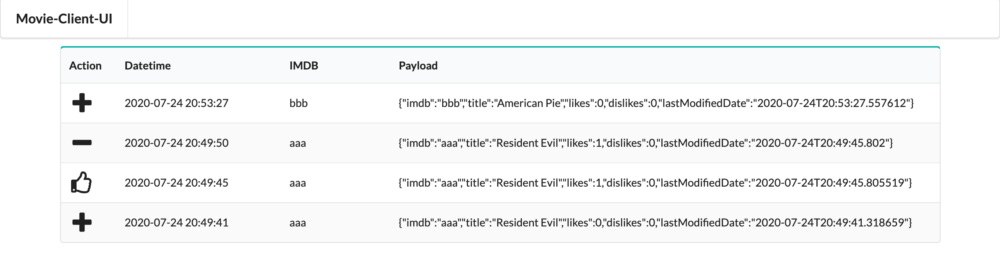

# springboot-rsocket-webflux-aop

The goal of this project is to play with [`RSocket`](https://rsocket.io/) protocol. For it, we will implement three [`Spring Boot`](https://docs.spring.io/spring-boot/docs/current/reference/htmlsingle/) Java applications: `movie-server`, `movie-client-shell` and `movie-client-ui`. As storage, it's used the reactive NoSQL database [`MongoDB`](https://www.mongodb.com/). All the streaming of movie events and the logging are handling by AOP (Aspect Oriented Programming).

## Project Architecture


## Applications

- ### movie-server

  `Spring Boot` Java Web application that exposes REST API endpoints or RSocket routes to manage `movies`. Movies data are stored in reactive `MongoDB`.
  
  `movie-server` has the following profiles:
  
  - `default`
     - start REST API on port `8080` and uses `HTTP`
     
  - `rsocket-tcp`
     - start REST API on port `8080` and uses `HTTP`
     - start RSocket on port `7000` and uses `TCP`
     
  - `rsocket-websocket`
     - start REST API on port `8080` and uses `HTTP`
     - start RSocket with mapping-path `/rsocket` and uses `WebSocket`

- ### movie-client-shell

  `Spring Boot` Shell Java application that has a couple of commands to interact with `movie-server`.
  
  The picture below show those commands
  
  

  It has the following profiles:
  
  - `default`
     - start shell with enabled commands to call `movie-server` REST API endpoints using `HTTP`
     
  - `rsocket-tcp`
     - start shell with enabled commands to call `movie-server` REST API endpoints using `HTTP`
     - start shell with enabled commands to call `movie-server` RSocket routes using `TCP`
     
  - `rsocket-websocket`
     - start shell with enabled commands to call `movie-server` REST API endpoints using `HTTP`
     - start shell with enabled commands to call `movie-server` RSocket routes using `WebSocket`

- ### movie-client-ui

  `Spring Boot` Java Web application that uses [`Thymeleaf`](https://www.thymeleaf.org/) and `Websocket` to show at real-time all the events generated when movies are added, deleted, liked and disliked.

  

  `movie-client-ui` has the following profiles:
  
  - `default`
     - start REST API on port `8081` and uses `HTTP`
     - does not connect to `movie-server` through `RSocket`; does not receive movie events;
     
  - `rsocket-tcp`
     - start REST API on port `8080` and uses `HTTP`
     - connects to `movie-server` through `RSocket`using `TCP`; receives movie events;
     
  - `rsocket-websocket`
     - start REST API on port `8080` and uses `HTTP`
     - connects to `movie-server` through `RSocket`using `WebSocket`; receives movie events;

## Demo

The GIF below shows a user running some commands in `movie-client-shell`, terminal on the right. In the right-top terminal is running `movie-server` and in the right-bottom, `movie-client-ui`. On the background, there's a browser where movie events are displayed. 


## Prerequisites

- [`Java 11+`](https://www.oracle.com/java/technologies/javase-jdk11-downloads.html)
- [`Docker`](https://www.docker.com/)
- [`Docker-Compose`](https://docs.docker.com/compose/install/)

## Start Environment

- Open a terminal and inside `springboot-rsocket-webflux-aop` root folder run
  ```
  docker-compose up -d
  ```

- Wait until `mongodb` is Up (healthy). You can check the status by running
  ```
  docker-compose ps
  ```

## Running applications with Maven

- **movie-server**

  Open a new terminal and, inside `springboot-rsocket-webflux-aop` root folder, run one of the following commands
  
  | Profile           | Command                                                                                           |
  | ----------------- | ------------------------------------------------------------------------------------------------- |
  | rsocket-tcp       | ./mvnw clean spring-boot:run --projects movie-server -Dspring-boot.run.profiles=rsocket-tcp       |
  | rsocket-websocket | ./mvnw clean spring-boot:run --projects movie-server -Dspring-boot.run.profiles=rsocket-websocket |
  | default           | ./mvnw clean spring-boot:run --projects movie-server                                              |
  
- **movie-client-shell**

  Open a new terminal and, inside `springboot-rsocket-webflux-aop` root folder, run the following command to build the executable jar file
  ```
  ./mvnw clean package -DskipTests --projects movie-client-shell
  ```

  To start `movie-client-shell` run one of the following commands (it should match with the one picked to run `movie-server`)
  
  | Profile           | Commands                                                                                                    |
  | ----------------- | ----------------------------------------------------------------------------------------------------------- |
  | rsocket-tcp       | export SPRING_PROFILES_ACTIVE=rsocket-tcp && ./movie-client-shell/target/movie-client-shell-1.0.0.jar       |
  | rsocket-websocket | export SPRING_PROFILES_ACTIVE=rsocket-websocket && ./movie-client-shell/target/movie-client-shell-1.0.0.jar |
  | default           | export SPRING_PROFILES_ACTIVE=default && ./movie-client-shell/target/movie-client-shell-1.0.0.jar           |

- **movie-client-ui**

  Open a new terminal and, inside `springboot-rsocket-webflux-aop` root folder, run one of the following commands (it should match with the one picked to run `movie-server`)
  
  | Profile           | Command                                                                                              |
  | ----------------- | ---------------------------------------------------------------------------------------------------- |
  | rsocket-tcp       | ./mvnw clean spring-boot:run --projects movie-client-ui -Dspring-boot.run.profiles=rsocket-tcp       |
  | rsocket-websocket | ./mvnw clean spring-boot:run --projects movie-client-ui -Dspring-boot.run.profiles=rsocket-websocket |
  | default           | ./mvnw clean spring-boot:run --projects movie-client-ui                                              |

## Running applications as Docker containers

- ### Build Docker images

  - In a terminal, make sure you are in `springboot-rsocket-webflux-aop` root folder
  - Run the following script to build the Docker images
    - JVM
      ```
      ./docker-build.sh
      ```
    - Native (it's not implemented yet)
      ```
      ./docker-build.sh native
      ```

- ### Environment variables

  - **movie-server**

    | Environment Variable | Description                                                       |
    | -------------------- | ----------------------------------------------------------------- |
    | `MONGODB_HOST`       | Specify host of the `Mongo` database to use (default `localhost`) |
    | `MONGODB_PORT`       | Specify port of the `Mongo` database to use (default `27017`)     |

  - **movie-client-shell**

    | Environment Variable | Description                                                     |
    | -------------------- | --------------------------------------------------------------- |
    | `MOVIE_SERVER_HOST`  | Specify host of the `movie-server` to use (default `localhost`) |

  - **movie-client-ui**

    | Environment Variable | Description                                                     |
    | -------------------- | --------------------------------------------------------------- |
    | `MOVIE_SERVER_HOST`  | Specify host of the `movie-server` to use (default `localhost`) |

- ### Start Docker containers

  - In a terminal, make sure you are inside `springboot-rsocket-webflux-aop` root folder
  - Run following command
    - rsocket-tcp
      ```
      ./start-server-and-ui.sh rsocket-tcp && ./start-shell.sh rsocket-tcp
      ```
    - rsocket-websocket
      ```
      ./start-server-and-ui.sh rsocket-websocket && ./start-shell.sh rsocket-websocket
      ```
    - default
      ```
      ./start-server-and-ui.sh && ./start-shell.sh
      ```

## Application's URL

| Application     | Type     | Transport | URL                         |
| --------------- | -------- | --------- | --------------------------- |
| movie-server    | RSocket  | TCP       | tcp://localhost:7000        |
| movie-server    | RSocket  | WebSocket | ws://localhost:8080/rsocket |
| movie-server    | REST     | HTTP      | http://localhost:8080       |
| movie-client-ui | Website  | HTTP      | http://localhost:8081       |

> **Note:** you can see the clients connected to `movie-server` by calling the `info` actuator endpoint
> ```
> curl -i localhost:8080/actuator/info
> ```

## Playing Around with movie-client-shell commands

> **Note:** to run the commands below, you must start `movie-server` and `movie-client-shell` with `rsocket-tcp` or `rsocket-websocket` profiles

- Go to `movie-client-shell` terminal

- Add a movie using RSocket (`Request-Response`) 
  ```
  add-movie-rsocket --imdb aaa --title "RSocketland"
  ```
  
  It should return
  ```
  {"imdb":"aaa","title":"RSocketland","lastModifiedDate":"2020-07-20T12:43:39.857248","likes":0,"dislikes":0}
  ```
  
- Add a movie using REST
  ```
  add-movie-rest --imdb bbb --title "I, REST"
  ```
  
  It should return
  ```
  {"imdb":"bbb","title":"I, REST","lastModifiedDate":"2020-07-20T12:44:13.266657","likes":0,"dislikes":0}
  ```
  
- Send a like to `RSocketland` movie using RSocket (`Fire-And-Forget`)
  ```
  like-movie-rsocket --imdb aaa
  ```

  It should return
  ```
  Like submitted
  ```

- Get all movies using RSocket (`Request-Stream`)
  ```
  get-movies-rsocket
  ```
  
  It should return
  ```
  {"imdb":"aaa","title":"RSocketland","lastModifiedDate":"2020-07-20T12:56:34.565","likes":1,"dislikes":0}
  {"imdb":"bbb","title":"I, REST","lastModifiedDate":"2020-07-20T12:56:26.846","likes":0,"dislikes":0}
  ```
  
- Select movies using RSocket (`Channel`)
  ```
  select-movies-rsocket --imdbs aaa,bbb
  ```

  It should return
  ```
  | IMBD: aaa        | TITLE: RSocketland                    | LIKES: 1     | DISLIKES: 0     |
  | IMBD: bbb        | TITLE: I, REST                        | LIKES: 0     | DISLIKES: 0     |
  ```
  
- Delete movie `RSocketland` using RSocket (`Request-Response`) and `I, REST` using REST
  ```
  delete-movie-rsocket --imdb aaa
  delete-movie-rest --imdb bbb
  ```
  
- **Simulation**

  There are two scripts that contain some commands to add, retrieve, like, dislikes and delete movies. One uses REST and another RSocket to communicate with `movie-server`. At the end of the script execution, it's shown the `Execution Time` in `milliseconds`.
  
  - If you are running the applications with Maven
    - REST
      ```
      script ../src/main/resources/simulation-rest.txt
      ```
    - RSocket
      ```
      script ../src/main/resources/simulation-rsocket.txt
      ```

  - If you are running the applications as Docker containers
    - REST
      ```
      script /app/resources/simulation-rest.txt
      ```
    - RSocket
      ```
      script /app/resources/simulation-rsocket.txt
      ```

## Useful Commands

- **MongoDB**

  Find all movies
  ```
  docker exec -it mongodb mongo
  use moviedb
  db.movies.find()
  ```
  > Type `exit` to get out of `MongoDB` shell

## Shutdown

- To stop `movie-client-shell`, go to its terminal and type `exit`
- To stop `movie-server` and `movie-client-ui`
  - If you start them with Maven, go to their terminals and press `Ctrl+C`
  - If you start them as Docker containers, make sure you are inside `springboot-rsocket-webflux-aop` root folder and run
    ```
    ./stop-server-and-ui.sh
    ```
- To stop and remove docker-compose `mongodb` container, network and volumes, run the command below inside `springboot-rsocket-webflux-aop` root folder
  ```
  docker-compose down -v
  ```

## TODO

- Add authentication and authorization using `Keycloak`

## References

- https://docs.spring.io/spring/docs/current/spring-framework-reference/web-reactive.html#rsocket
- https://spring.io/blog/2020/05/12/getting-started-with-rsocket-servers-calling-clients
- https://grapeup.com/blog/reactive-service-to-service-communication-with-rsocket-introduction/