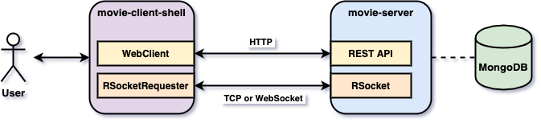
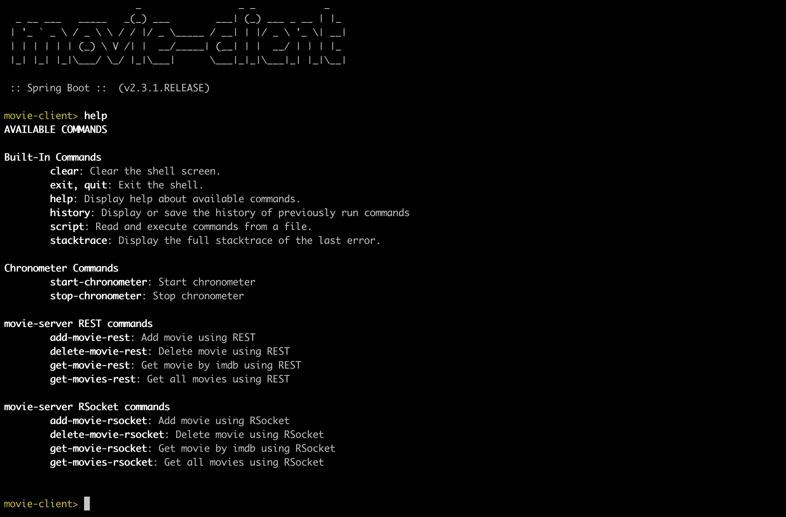

# springboot-rsocket

The goal of this project is to play with [`RSocket`](https://rsocket.io/) protocol. For it, we will implement two [`Spring Boot`](https://docs.spring.io/spring-boot/docs/current/reference/htmlsingle/) Java applications, `movie-client` and `movie-server`. As storage, we will use the reactive NoSQL database [`MongoDB`](https://www.mongodb.com/).

## Project Architecture



## Applications

- **movie-server**

  `Spring Boot` Java Web application that exposes some endpoints to manage `movies`. `movie-server` uses `MongoDB` as storage.
  
  There are two ways a movie can be added/retrieved/deleted using (shown in the table below)
  
  |              | REST API                                | RSocket                          |
  | ------------ | --------------------------------------- | -------------------------------- |
  | Transport    | http                                    | tcp                              |
  | Port         | 8080                                    | 7000                             |
  | Endpoints /  | `GET /api/movies`                       | `get-movies`                     |
  | Routes       | `GET /api/movies/{imdb}`                | `get-movie -d {"imdb"}`          |
  |              | `POST /api/movies -d {"imdb", "title"}` | `add-movie -d {"imdb", "title"}` |
  |              | `DELETE /api/movies/{imdb}`             | `delete-movie -d {"imdb"}`       |

- **movie-client**

  `Spring Boot` Shell Java application that has a couple of commands to interact with `movie-server`. The picture below show those commands.

  

## Prerequisites

- [`Java 11+`](https://www.oracle.com/java/technologies/javase-jdk11-downloads.html)
- [`Docker`](https://www.docker.com/)
- [`Docker-Compose`](https://docs.docker.com/compose/install/)

## Start Environment

- Open a terminal and inside `springboot-rsocket` root folder run
  ```
  docker-compose up -d
  ```

- Wait a little bit until all containers are Up (healthy). You can check their status running
  ```
  docker-compose ps
  ```

## Start applications

- **movie-server**

  Open a new terminal and, inside `springboot-rsocket` root folder, run the following command
  ```
  ./mvnw clean spring-boot:run --projects movie-server
  ```
  
- **movie-client**

  Open a new terminal and, inside `springboot-rsocket` root folder, run the following command to build the executable jar file
  ```
  ./mvnw clean package -DskipTests --projects movie-client
  ```

  To start `movie-client` run
  ```
  ./movie-client/target/movie-client-0.0.1-SNAPSHOT.jar
  ```
  
## Application's URL

| Application  | Type    | URL                   |
| ------------ | ------- | --------------------- |
| movie-server | RSocket | tcp://localhost:7000  |
| movie-client | REST    | http://localhost:8080 |

## Useful Commands & Links

- **MongoDB**

  Find all movies
  ```
  docker exec -it mongodb mongo
  db.movies.find()
  ```
  > Type `exit` to get out of `MongoDB` shell

## TODO

- implement fire-forget when customer sends a score from 0 to 10 to a movie;
- implement websocket that outputs all movies added/deleted in realtime;